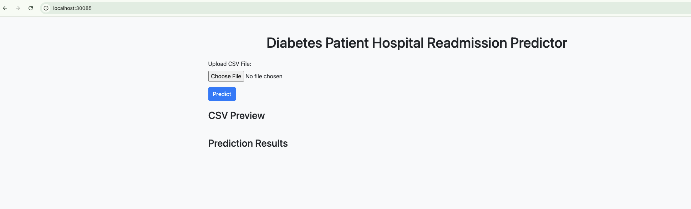
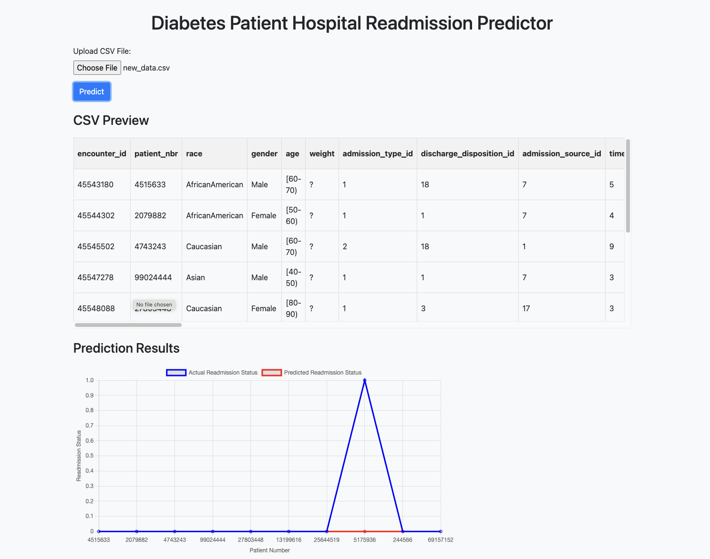

# mediwatch_capstone_2024
Machine Learning to Predict the re-admission of Diabetic Patients. 

## Table of Contents
- [Orchestration](#orchestration)
    - [Build the docker image](#build-the-docker-image)
    - [Create namespace, deployment and service](#create-namespace-deployment-and-service)
- [Application](#application)    

## Orchestration

### Build the docker image 

1. Clone the git repo 
```
Kashyaps-MBP: kashyapkambhatla$ git clone git@github.com:kashyap3881/mediwatch_capstone_2024.git
Cloning into 'mediwatch_capstone_2024'...
remote: Enumerating objects: 33, done.
remote: Counting objects: 100% (33/33), done.
remote: Compressing objects: 100% (30/30), done.
remote: Total 33 (delta 7), reused 26 (delta 3), pack-reused 0 (from 0)
Receiving objects: 100% (33/33), 7.33 MiB | 11.26 MiB/s, done.
Resolving deltas: 100% (7/7), done.
```

2. Run the below command to generate the docker image. As shown below different versions could be built
```
Kashyaps-MBP:mediwatch_capstone_2024 kashyapkambhatla$ docker build --build-arg PORT=9003 -t mediwatch:v1 .
[+] Building 106.2s (10/10) FINISHED                                                                                                                                                                                                                                         docker:desktop-linux
 => [internal] load build definition from Dockerfile                                                                                                                                                                                                                                         0.0s
 => => transferring dockerfile: 277B                                                                                                                                                                                                                                                         0.0s
 => [internal] load metadata for docker.io/library/python:3.10.12                                                                                                                                                                                                                            0.9s
 => [auth] library/python:pull token for registry-1.docker.io                                                                                                                                                                                                                                0.0s
 => [internal] load .dockerignore                                                                                                                                                                                                                                                            0.0s
 => => transferring context: 2B                                                                                                                                                                                                                                                              0.0s
 => [internal] load build context                                                                                                                                                                                                                                                            0.0s
 => => transferring context: 14.12kB                                                                                                                                                                                                                                                         0.0s
 => CACHED [1/4] FROM docker.io/library/python:3.10.12@sha256:bac3a0e0d16125977e351c861e2f4b12ecafeaa6f72431dc970d0b9155103232                                                                                                                                                               0.0s
 => [2/4] COPY . /app                                                                                                                                                                                                                                                                        1.1s
 => [3/4] WORKDIR /app                                                                                                                                                                                                                                                                       0.0s
 => [4/4] RUN pip3 install -r requirements.txt                                                                                                                                                                                                                                              89.8s
 => exporting to image                                                                                                                                                                                                                                                                      14.3s 
 => => exporting layers                                                                                                                                                                                                                                                                     14.3s 
 => => writing image sha256:0b8aeca086e500af521186507d6b285a2aeacbcf9a09b28fe97d6a1149994158                                                                                                                                                                                                 0.0s 
 => => naming to docker.io/library/mediwatch:v1                                                                                                                                                                                                                                              0.0s 
                                                                                                                                                                                                                                                                                                  
View build details: docker-desktop://dashboard/build/desktop-linux/desktop-linux/yg15hc12n421gacc0ksmda3qb                                                                                                            

What's next:
    View a summary of image vulnerabilities and recommendations → docker scout quickview 
```

### Create namespace, deployment and service 

1. Create a namespace for the application 
```
(base) Kashyaps-MBP:mediwatch_capstone_2024 kashyapkambhatla$ kubectl create ns mediwatch 
namespace/mediwatch created

(base) Kashyaps-MBP:mediwatch_capstone_2024 kashyapkambhatla$ kubectl get ns
NAME              STATUS   AGE
default           Active   75d
kube-node-lease   Active   75d
kube-public       Active   75d
kube-system       Active   75d
mediwatch         Active   4s
test-model        Active   36d
```

2. Create deployment template and deploy in the namespace 
```
(base) Kashyaps-MBP:~ kashyapkambhatla$ cat mediwatchdep.yaml 
apiVersion: apps/v1
kind: Deployment
metadata:
  name: mediwatch-deployment
spec:
  replicas: 1
  selector:
    matchLabels:
      app: mediwatch
  template:
    metadata:
      labels:
        app: mediwatch
    spec:
      containers:
      - name: mediwatch-container
        image: mediwatch:v1
        imagePullPolicy: IfNotPresent 
        ports:
        - containerPort: 9003
        env:
        - name: PORT
          value: "9003"  # Note: Environment variable values are strings
```

```
(base) Kashyaps-MBP:~ kashyapkambhatla$ kubectl apply -f mediwatchdep.yaml -n mediwatch 
deployment.apps/mediwatch-deployment created

(base) Kashyaps-MBP:~ kashyapkambhatla$ kubectl get pods -n mediwatch 
NAME                                   READY   STATUS    RESTARTS   AGE
mediwatch-deployment-9b76d8b57-5wtsv   1/1     Running   0          8s
```

2. Create service template and deploy in the namespace. This will help expose the service to become accessible via a nodeport and also serve as a load balancer 

```
(base) Kashyaps-MBP:~ kashyapkambhatla$ cat mediwatchservice.yaml 
apiVersion: v1
kind: Service
metadata:
  name: mediwatch-service
spec:
  selector:
    app: mediwatch
  ports:
    - protocol: TCP
      port: 80
      targetPort: 9003
      nodePort: 30085
  type: NodePort
```

```
(base) Kashyaps-MBP:~ kashyapkambhatla$ kubectl apply -f mediwatchservice.yaml -n mediwatch 
service/mediwatch-service created

(base) Kashyaps-MBP:~ kashyapkambhatla$ kubectl get service -n mediwatch 
NAME                TYPE       CLUSTER-IP       EXTERNAL-IP   PORT(S)        AGE
mediwatch-service   NodePort   10.109.141.194   <none>        80:30085/TCP   14s

```

3. Access the application via browser at http://ip:30085/. If deploying on your MAC/PC then you could use http://localhost:30085/


## Application
1. Accessing the applcation would bring up a window as shown below.




2. Click on the Choose File button to upload the CSV file. A sample test file is provided in the repo as test_data.csv

3. Click on the Predict button to get the prediction results.

4. The readmission prediction results for every patient would then be displayed as shown below.

